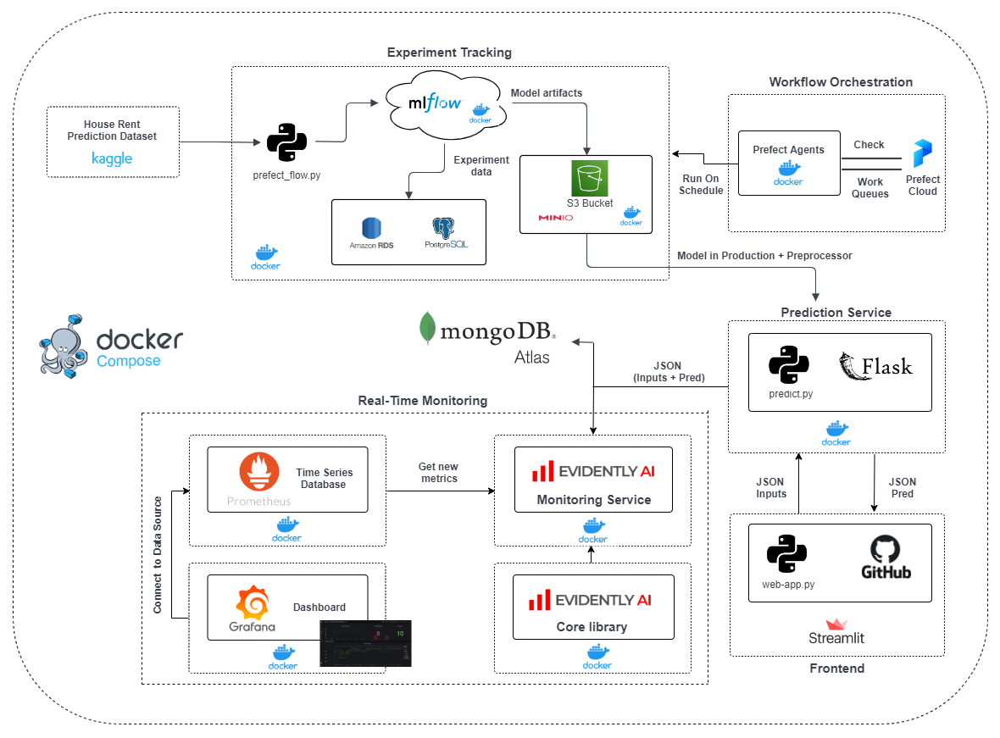

# House Rent Prediction

This repository contains the final project for the [MLOps Zoomcamp](https://github.com/DataTalksClub/mlops-zoomcamp) course provided by [DataTalks.Club](https://datatalks.club/).
The project consists of a **Machine Learning Pipeline** built with some of the most important aspects of MLOps : Experiment Tracking, Workflow Orchestration, Model Deployment and Monitoring.

## Context

Housing in India varies from palaces of erstwhile maharajas to modern apartment buildings in big cities to tiny huts in far-flung villages. There has been tremendous growth in India's housing sector as incomes have risen. The Human Rights Measurement Initiative finds that India is doing 60.9% of what should be possible at its level of income for the right to housing.

Renting, also known as hiring or letting, is an agreement where a payment is made for the temporary use of a good, service, or property owned by another. A gross lease is when the tenant pays a flat rental amount and the landlord pays for all property charges regularly incurred by the ownership. Renting can be an example of the sharing economy.

## Dataset

The dataset used to feed the MLOps pipeline has been downloaded from [Kaggle](https://www.kaggle.com/datasets/iamsouravbanerjee/house-rent-prediction-dataset). In this Dataset, we have information on almost 4700+ Houses/Apartments/Flats Available for Rent with different parameters like BHK, Rent, Size, No. of Floors, Area Type, Area Locality, City, Furnishing Status, Type of Tenant Preferred, No. of Bathrooms, Point of Contact.

### Dataset Glossary (Column-Wise)

| Feature | Description |
| --- | --- |
|BHK | Number of Bedrooms, Hall, Kitchen.|
|Rent | Rent of the Houses/Apartments/Flats.|
|Size | Size of the Houses/Apartments/Flats in Square Feet.|
|Floor | Houses/Apartments/Flats situated in which Floor and Total Number of Floors (Example: Ground out of 2, 3 out of 5, etc.)|
|Area Type | Size of the Houses/Apartments/Flats calculated on either Super Area or Carpet Area or Build Area.|
|Area Locality | Locality of the Houses/Apartments/Flats.|
|City | City where the Houses/Apartments/Flats are Located.|
|Furnishing Status | Furnishing Status of the Houses/Apartments/Flats, either it is Furnished or Semi-Furnished or Unfurnished.|
|Tenant Preferred | Type of Tenant Preferred by the Owner or Agent.|
|Bathroom | Number of Bathrooms.|
|Point of Contact | Whom should you contact for more information regarding the Houses/Apartments/Flats.|

## MLOPS Architecture



## Applied technologies

| Name | Scope |
| --- | --- |
| Jupyter Notebooks | Exploratory data analysis and pipeline prototyping. |
| Docker | Application containerization. |
| Docker-Compose | Multi-container Docker applications definition and running. |
| Prefect/Prefect Cloud | Workflow orchestration. |
| MLFlow | Experiment tracking and model registry. |
| PostgreSQL RDS| MLFLow experiment tracking database. |
| MongoDB Atlas| NoSQL Document Database in the Cloud for storing our predictions.|
| MinIO | High Performance Object Storage compatible with Amazon S3 cloud storage service. |
| Flask | Web server. |
| Streamlit | Frontend toolkit for Data Science. |
| EvidentlyAI | ML models evaluation and monitoring. |
| Prometheus | Time Series Database for ML models real-time monitoring. |
| Grafana | ML models real-time monitoring dashboards. |
| pytest | Python unit testing suite. |
| pylint | Python static code analysis. |
| black | Python code formatting. |
| isort | Python import sorting. |
| Pre-Commit Hooks | Simple code issue identification before submission. |
| GitHub Actions | CI/CD pipelines. |

## Cloud Services

During the implementation of this project, we used some cloud services such as [Prefect Cloud](https://docs.prefect.io/ui/cloud-getting-started/), [PostgreSQL RDS](https://aws.amazon.com/rds/postgresql/), [MongoDB Atlas](https://www.mongodb.com/atlas/database), [S3](https://docs.aws.amazon.com/s3/index.html) and [Streamlit Cloud](https://streamlit.io/cloud) as mentioned above. It is possible to run all those services inside docker containers but because we didn't want to have all our services running in a single machine, we decided to use cloud services for storing data so that if our machine crashes for any reasons, we will be able to retreive our service's data easiliy.

## Data Exploration

You can find the notebook used to perform our Exploratory Data Analysis [here](app/EDA.ipynb).

## Data Modeling

After performing EDA to better understand our dataset. We are ready to perform data modeling (feature engineering, feature importance, model selection etc...). You can click [here](app/modeling.ipynb) to see the data modeling's part of our project. What does the code do ?

1. It retrieves the data.
2. It then splits training and validation data and fits a DictVectorizer and StandardScaler.
3. It tunes hyperparameters from an XGboost classifier and a Random Forest classifier, and logs every metrics in MLflow runs.
4. It registers the model (best one) as the production one in the registry if it is a better one than the current model in production (comparing rmse metrics).

## Workflow Orchestration

Once we have finished data modeling, we need to turn our jupyter notebook into a python script with the help of a workflow orchestrator. In our case, we used [Prefect](https://www.prefect.io/) as a workflow orchestrator. We will also use Prefect Cloud for storing our flow runs. To do that, you need to create a [prefect cloud](https://docs.prefect.io/ui/cloud-getting-started/) account, then you create a workspace (eg: house-rent-prediction). Then, you need to go to your profile and create an **API Key** to access Prefect Cloud from Docker container. For more informations on how to manually configure Cloud settings and run a flow with Prefect Cloud, you can click [here](https://docs.prefect.io/ui/cloud-getting-started/).

## Prediction Service

This step consists of creating a web-service for making predictions. We will use [Flask](https://flask.palletsprojects.com/en/2.2.x/) as a web-server.
Here is the logic of how the service works:

1. Load the preprocessor (DictVectorizer and StandardScaler) that transform the input data.
2. Load the current production model from Mlflow registry.
3. Send (Inputs data + Prediction) in our MongoDB database.
4. Send (Inputs data + Prediction) in our Monitoring Service for calculting metrics in real-time.
4. Send the prediction back to the client.

You can click [here](app/predict.py) if you want see the python script.

## Web Application

To build our frontend app, we used [streamlit](https://streamlit.io/cloud). Streamlit is a python package that allow us to easily build web app for Data Science and Machine Learning. The code of this step is [here](web-app/web-app.py). What does the code do?

1. It first connect to our Mongo Database from Mongo Atlas. (This database is used to store suggestions from users).
2. Users fill the form with the desired characteristics of the house.
3. Then, they click on the Predict Button to make a prediction. 

To deploy this app, we used **Streamlit Cloud.** You can click [here](https://docs.streamlit.io/streamlit-cloud/get-started/deploy-an-app) to see how to deploy an app with streamlit Cloud. Basically your are required to provide all the dependencies needed to run your app in a **requirements.txt** file, and also provide all the environment variables.
When you will deploy your app, you need to provide the location of your app (python inside) from your github account. Since we'll use MongoDB, you also need to add their outbound IP addresses in your MongoDB server. Click [here](https://docs.streamlit.io/streamlit-cloud/get-started/deploy-an-app/connect-to-data-sources/stable-outbound-ip-addresses) to see their current six stable outbound IP addresses.
We will cover how to set up the database in the **Prequisites** section.

Click [Here](https://emoloic-house-rent-prediction-web-appweb-app-jfwuu2.streamlitapp.com) to see how the app looks. (Maybe you won't be able to make predictions because the server is not running when you are reviewing the code.)

## Real-time Monitoring

As you can see in the pipeline diagram, we chose **Evidently AI** to monitor the pipeline. The code of this step is [here](monitoring/app.py). What does the code do ?

1. Get reference file (the location) from Mlflow (the location of the reference file is logged as a parameter in Mlflow). We did that because our production model is deployed automatically and the only way the get the location of the file used to train the model is to log it as a parameter in Mlflow. Normally we can configure the reference file in the [config.yml](monitoring/config.yaml) file of Evidently. Two datasets are needed to compare reference data and the current data.
2. Get predictions from our current data from our Prediction Service. To do that, we need to configure how Evidently will calculate the metrics inside the [config.yml](monitoring/config.yml) file. (In our case, we are monitoring **Data Drift** and **Numerical Target Drift**).
3. The Evidently Service then exposes a Prometheus endpoint (Prometheus checks new metrics from time to time and log them to the database).
4. Prometheus is then used as a data source to Grafana (The visualization and alerting functionality).

All the config files required for real-time monitoring are inside the [monitoring](monitoring) folder.

NB: If you want to understand more about how the integration of Evidently and Grafana works, You can visit their github repo [here](https://github.com/evidentlyai/evidently/tree/main/examples/integrations/grafana_monitoring_service).


## Deployment

You can easily deployed the entire app via the following steps:

1. Clone the `house-rent-prediction` repository locally:

    ```bash
    $ git clone https://github.com/emoloic/house-rent-prediction.git
    ```

2. Install the pre-requisites necessary to run the pipeline:

    ```bash
    $ cd house-rent-prediction
    $ sudo apt install make
    $ make prerequisites
    ```
	
	When you run the last command above, it will fisrt update your software packages, then install docker, python, pipenv, docker-compose in your VM.
	
    It is also suggested to add the current user to the `docker` group to avoid running the next steps as `sudo`:

    ```bash
    $ sudo groupadd docker
    $ sudo usermod -aG docker $USER
    ```

    then, logout and log back in so that the group membership is re-evaluated.
	
	We also need to log in to [Docker Hub](https://hub.docker.com/) and use the free private repository offered so that our docker images will keep private. (You can use another Image repository such as ECR, GCR), but you will need to make some changes in the code.
	We called this repository **house-rent-prediction.** This repository will content all our docker images.
	
	Now we need to log in to Docker Hub from our VM in other to pull the images. To do that, you need to run the following command:
	
	```bash
    $ docker login -u ******
    ```
	
	In this step, you need to provide your Docker Hub username and password. Once, you've done all the previous steps, you can move to the next step.
	
	Now, you need to create an **AWS account** if you don't have yet and use the free tier to create a PostgreSQL Database. (As mentioned above, this database is used to store our Mflow experiment data). You will also need to create a user and attach a policy that allows the user to perform all the actions on S3 bucket. (Don't forget to make accessible your database from anywhere in other to perform CI/CD)
	
	You will also need to create a MongoDB database from [mongoDB Atlas](https://www.mongodb.com/) and add your VM's IP address to connect to the database. You can use the free cluster offered but ideally, it's not recommended to use this type of cluster in production. It's just for experimentation.
	
	Next, you will create a [prefect cloud](https://docs.prefect.io/ui/cloud-getting-started/) account, create a workspace (eg: house-rent-prediction). Then, you need to go to your profile and create an API Key to access Prefect Cloud from Docker container. For more informations on how to manually configure Cloud settings and run a flow with Prefect Cloud, you can click [here](https://docs.prefect.io/ui/cloud-getting-started/).	
	In other, to run our flow with Prefect Cloud, we need to provide the **PREFECT_API_URL** and **PREFECT_API_KEY** as environment variables.
	
	Once you've done all these steps, keep in mind that you are required to set all the [environment variables](./.env-vars) in order to start all the services inside the docker-compose.yml file (click [here](./docker-compose.yml) to see all the environment variables).
	
	If you want to clearly understand how it works, you need to read the [docker-compose](./docker-compose.yml) file and the [Makefile](./Makefile).
	
	NB: For **integration tests**, you need the named your environment variables differently from your production environment variables. You can the prefix **test-**. Don't forget to set your kaggle and Docker Hub credentials as well.
	
3. [*Optional*] Configure the development evironment:

    ```bash
    $ make setup
    ```

    This is required to perform further development and testing on the pipeline.

4. Pull the Docker images:

    ```
    $ make pull
    ```

6. Launch the MLOps pipeline:

    ```
    $ make run
    ```

    Once ready, the following services will be available:

    | Service | Port | Interface | Description |
    | --- | --- | --- | --- |
    | Prefect | 4200 | 127.0.0.1 | Training workflow orchestration |
    | MLFlow | 5000 | 127.0.0.1 | Experiment tracking and model registry |
    | MinIO | 9001 | 127.0.0.1 | S3-equivalent bucket management |
    | Evidently | 8085 | 127.0.0.1 | Data and Numerical Target Drift |
    | Grafana | 3000 | 127.0.0.1 | Data and Numerical Target Drift real-time dashboards |

	You can modify the security group of your VM to allow inbound traffic to those ports.

7. Once the MLOps pipeline has been started, the prediction web service can already work thanks to a default pre-trained model available in the Docker image. In order to enable pipeline training workflow it is necessary to create a scheduled Prefect deployment via:

	```
	$ make deployment
	```

	The training workflow will be then automatically executed the fist day of every month. It will download the latest dataset (if the Kaggle credentials have been provided), search the best model in terms of rmse metric among XGBoost, Random Forest and finally will store it in the model registry. It is worth noting the training workflow can also be immediately executed without waiting the next schedule:

	```
	$ make train
	```

	Once the updated model is ready, it can be moved to production by restarting the pipeline:

	```
	$ make restart
	```

	the web service will automatically connect to the registry and get the most updated model. If the model is still not available, it will continue to use the default one.

8. It is possible to generate simulated traffic via:

	```
	$ make generate-traffic
	```

	Then, the prediction service can be monitored via Grafana (in real-time) `http://127.0.0.1:3000`.
	
9.	The MLOps pipeline can be disposed via:

	```
	$ make kill
	```
	
## GitHub Actions

- **Continuous Integration**: On every push and pull request on `main` and `dev` branches, the Docker images are built, tested and then pushed to DockerHub.
- **Continuous Deployment**: On every push and pull request on `main` branch, only if the Continuous Integration workflow has been successful successful, the updated pipeline is deployed to the target server and run.

